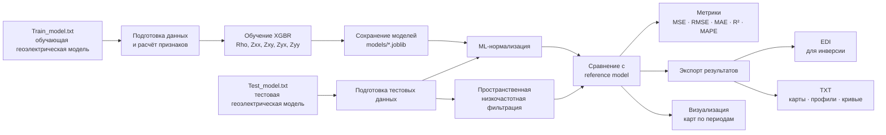

# Приветствую!

[English version](README_EN.md)

Представленный проект предназначен для коррекции статического сдвига
амплитудных кривых МТЗ с применением двух методик нормализации: слегка
улучшенной версии низкочастотной пространственной фильтрации и
градиентного бустинга XGBR.

## Схема пайплайна



# Немного теории

Наблюдённый тензор импеданса можно представить в виде матричного
уравнения:

$$
[Z_S] = [e][Z_R],
$$

где $[Z_S]$ --- наблюдённый тензор импеданса, $[Z_R]$ --- тензор
импеданса, соответствующий региональной структуре, $[e]$ --- матрица
локальных гальванических искажений. Если решить это уравнение для
компонент регионального тензора импеданса, получаем:

$$
Z_{xx}^{R} =
\frac{e_{yy}Z_{xx}^{S}-e_{xy}Z_{yx}^{S}}
{e_{xx}e_{yy}-e_{xy}e_{yx}},
$$

$$
Z_{xy}^{R} =
\frac{e_{yy}Z_{xy}^{S}-e_{xy}Z_{yy}^{S}}
{e_{xx}e_{yy}-e_{xy}e_{yx}},
$$

$$
Z_{yx}^{R} =
\frac{-e_{yx}Z_{xx}^{S}+e_{xx}Z_{yx}^{S}}
{e_{xx}e_{yy}-e_{xy}e_{yx}},
$$

$$
Z_{yy}^{R} =
\frac{-e_{yx}Z_{xy}^{S}+e_{xx}Z_{yy}^{S}}
{e_{xx}e_{yy}-e_{xy}e_{yx}}.
$$

Как видно из уравнений, на компоненты $Z_{xx}$ и $Z_{xy}$ оказывают
влияние компоненты гальванических искажений $e_{yy}$ и $e_{xy}$, а на
$Z_{yx}$ и $Z_{yy}$ --- соответственно $e_{yx}$ и $e_{xx}$. Таким
образом, для нормализации дополнительных компонент можно использовать
коэффициенты от соответствующих им главных компонент.

При низкочастотной фильтрации используется экспоненциальный
пространственный фильтр. Полуширина --- регулирующий параметр в
показателе экспоненциального фильтра, задаваемый соизмеримым с глубиной
залегания исследуемой структуры. При бесконечной полуширине фильтра
выполняется осреднение по всем точкам с единичным весом, при нулевой
полуширине результат фильтрации совпадает с исходными данными.

# Данные

В проекте используются две геоэлектрические модели: одна для обучения
--- `data/Train_model.txt`, вторая для тестирования регрессоров ---
`data/Test_model.txt`. Для обучения используется модель с астеносферным
поднятием и двумя призмами, описанная в статье: Попов Д. Д., Пушкарев П.
Ю. Чувствительность магнитотеллурических зондирований к типичным
аномалиям электропроводности в тектоносфере // Вестник Московского
университета. Серия 4: Геология. --- 2023. --- № 6. --- С. 134--143. Для
тестирования использовалась модель типа "Грабен", описанная в следующей
статье: Суконкин М. А., Пушкарев П. Ю. Анализ синтетических
магнитотеллурических данных, рассчитанных для геоэлектрической модели с
приповерхностными неоднородностями // Геофизика. --- 2023. --- № 6. ---
С. 65--69.

# Принципы машинного обучения

Как было показано выше, для нормализации дополнительных компонент
тензора импеданса можно использовать коэффициенты смещения от главных
компонент.

Целевыми переменными при обучении регрессоров являются коэффициенты
статического сдвига: `KR` для эффективного кажущегося сопротивления и
`Kxx`, `Kxy`, `Kyx`, `Kyy` для соответствующих компонент тензора
импеданса. Для компонент тензора коэффициенты определяются как отношение
модуля наблюдённой компоненты к модулю соответствующей компоненты
эталонной модели. Регрессоры, таким образом, обучаются предсказывать
величину искажения, необходимую для последующей нормализации данных.

Фичами для обучения регрессора эффективного кажущегося сопротивления
являются: `Rho_mean_attitude` --- отношение величины в заданной точке к
среднему значению в скользящем окне 3×3; `Rho` --- эффективное кажущееся
сопротивление в точке; `absZxy` --- модуль главной компоненты тензора
импеданса; `imagZxy` --- мнимая часть главной компоненты тензора
импеданса.

Для главных компонент тензора импеданса используются схожие фичи.
Например, для `Zyx` это `Zyx_mean_attitude`, `Rho`, `absZyx`, `absZyy`,
`imagZyx`, а также `AlphaEgg2` --- различие главных направлений
простирания региональной структуры, определённых методами Эггерса
(неустойчив к влиянию приповерхностных неоднородностей) и фазового
тензора (этот метод, наоборот, не подвержен влиянию приповерхностных
искажений).

Для дополнительных компонент тензора импеданса, на примере `Zxx`,
используются `Zxx_mean_attitude`, `absZxx`, `imagZxx`, `AlphaEgg2`, а
также `Kxy_predicted` --- коэффициент сдвига, определённый для
соответствующей главной компоненты.

# Основные скрипты

-   scripts/train.py - используется для обучения регрессоров для
    предсказания коэффициента статического сдвига параметров Rho, Zxx,
    Zxy, Zyx, Zyy. Полученные модели сохраняются в models/. Используются
    данные из Train_model.txt
-   scripts/evaluate.py - используется для сравнения результатов
    нормализации методами пространственной низкочастотной фильтрации и
    градиентным бустингом. Используются данные из Test_model.txt. В
    результате выводится таблица с метриками, они же сохраняются в
    outputs/comparison_metrics.csv
-   scripts/write_edi.py - используется для записи данных в формате EDI
    поточечно для дальнейшей инверсии в outputs/edi.
-   scripts/write_txt.py - сохраняет данные тестовой модели в виде карт,
    профилей и точек в outputs/txt.
-   scripts/visualize_maps.py - сохраняет карты для 15 периодов для
    параметров Rho, Zxx, Zxy, Zyx, Zyy в папку visualization/maps

## Конфигурация проекта

Основные параметры эксперимента вынесены в `config.py`:

-   `ML_FEATURE_RADIUS_STEPS` --- радиус локального пространственного
    окружения, используемого для формирования признаков ML. Значение `1`
    соответствует окну `3 × 3`.
-   `RHO_K_PERIODS` --- периоды, по которым усредняются предсказанные
    коэффициенты коррекции `Rho` для получения единого пространственного
    поля $K_{\rho}$, применяемого ко всем периодам при оценке.
-   `FILTER_PERIOD` --- опорный период, используемый для
    пространственной фильтрации.
-   `FILTER_RADIUS_STEPS` --- радиус окрестности пространственного
    фильтра в шагах сетки наблюдений. Значение `1` соответствует окну
    `3 × 3`: центральная точка, четыре ортогональных и четыре
    диагональных соседа при их наличии.
-   `FILTER_HALF_WIDTH_STEPS` --- полуширина пространственного фильтра в
    шагах сетки наблюдений.

Радиус локального окружения для ML-признаков задаётся независимо от
параметров пространственного фильтра.

## Визуализация проекта:

Запуск:

``` text
python scripts/visualize_maps.py
```

Создаёт папку `visualization/Maps` с 75 PNG-файлами: по 15 периодов для
каждого из параметров `Rho`, `Zxx`, `Zxy`, `Zyx` и `Zyy`.

Каждый PNG-файл содержит четыре панели:

-   эталонная модель с однородным приповерхностным слоем;
-   модель с множеством приповерхностных неоднородностей;
-   результат пространственной фильтрации;
-   результат градиентного бустинга.

Для последних трёх панелей выводится RMSE относительно эталонной модели.
По горизонтальной оси отложена координата `Y`, по вертикальной --- `X`.

Для всего тестового набора данных используются три глобальные цветовые
шкалы, благодаря чему карты для разных периодов можно напрямую
сравнивать между собой:

-   одна логарифмическая шкала для эффективного кажущегося
    сопротивления;
-   одна общая логарифмическая шкала для `Zxy` и `Zyx`;
-   одна общая симметричная логарифмическая шкала для `Zxx` и `Zyy`,
    поскольку текущий результат ML содержит небольшое отрицательное
    скорректированное значение `Zxx`.

## Выходные данные

After training:

-   `models/XGBR_Rho.joblib`
-   `models/XGBR_Zxx.joblib`
-   `models/XGBR_Zxy.joblib`
-   `models/XGBR_Zyx.joblib`
-   `models/XGBR_Zyy.joblib`
-   `outputs/MT_Data_train.txt`
-   `outputs/training_spatial_filter_results.txt`

After evaluation:

-   `outputs/test_results.txt`
-   `outputs/comparison_metrics.csv`

After EDI export:

-   `outputs/edi/reference model/*.edi`
-   `outputs/edi/inhomogeneous near-surface layer/*.edi`
-   `outputs/edi/filtration result/*.edi`
-   `outputs/edi/ML result/*.edi`

After TXT export:

-   `outputs/txt/maps/*.txt` --- 15 files, one per period.
-   `outputs/txt/profiles/*.txt` --- 26 files: 7 constant-Y profiles and
    19 constant-X profiles.
-   `outputs/txt/curves/*.txt` --- 133 files, one per spatial point.

After map visualization:

-   `visualization/Maps/*.png`

## Требования и установка

Для работы проекта требуется Python и библиотеки, перечисленные в
`requirements.txt`: NumPy, pandas, scikit-learn, XGBoost, joblib, PyTest и
Matplotlib.

После клонирования или распаковки проекта зависимости можно установить
из его корневой папки:

``` text
pip install -r requirements.txt
```

После установки зависимостей скрипты проекта можно запускать из корневой
папки в порядке, указанном ниже.

## Тестирование с PyTest

В папке `tests/` находятся небольшие автоматические тесты, которые
позволяют быстро проверить, что после изменений основные части проекта
продолжают работать ожидаемым образом. Для их запуска используется
PyTest.

В текущей версии проекта тесты проверяют:

-   что после подготовки обучающих данных присутствуют все признаки,
    необходимые модели `Rho`, а также целевая переменная `KR`;
-   что функция экспоненциальных пространственных весов формирует окно
    правильного размера и корректно задаёт веса центральной,
    ортогональных и диагональных точек;
-   что радиус окружения, используемый для формирования ML-признаков,
    действительно не зависит от радиуса пространственного фильтра.

Запуск тестов:

``` text
python -m pytest -q
```

Ключ `-q` означает *quiet*: PyTest выводит сокращённый результат без
лишней служебной информации. Если все тесты пройдены, в конце будет
показано количество успешно выполненных тестов (`passed`). Если
какой-либо тест завершится ошибкой (`failed`), PyTest укажет, какой
именно тест не прошёл, и покажет место возникновения ошибки.

PyTest не оценивает качество обученных моделей и не заменяет сравнение
метрик. Здесь он используется как техническая проверка того, что
отдельные части кода после изменений работают согласованно.

## Весь пайплайн

``` text
python scripts/train.py
python scripts/evaluate.py
python scripts/write_edi.py
python scripts/write_txt.py
python scripts/visualize_maps.py
python -m pytest -q
```
