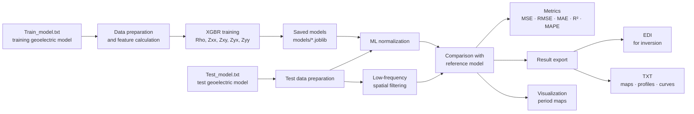
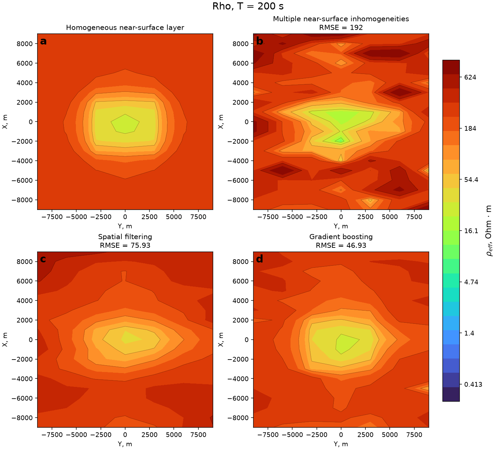

# Welcome!

[Русская версия](README.md)

This project is designed to correct static shifts in magnetotelluric
sounding (MTS) amplitude curves using two normalization methods: a
slightly improved version of low-frequency spatial filtering and XGBR
gradient boosting.

## Pipeline diagram



# A bit of theory

The observed impedance tensor can be represented by the following matrix
equation:

$$
[Z_S] = [e][Z_R],
$$

where $[Z_S]$ is the observed impedance tensor, $[Z_R]$ is the impedance
tensor corresponding to the regional structure, and $[e]$ is the matrix
of local galvanic distortions. Solving this equation for the components
of the regional impedance tensor gives:

$$
Z_{xx}^{R} =
\frac{e_{yy}Z_{xx}^{S}-e_{xy}Z_{yx}^{S}}
{e_{xx}e_{yy}-e_{xy}e_{yx}},
$$

$$
Z_{xy}^{R} =
\frac{e_{yy}Z_{xy}^{S}-e_{xy}Z_{yy}^{S}}
{e_{xx}e_{yy}-e_{xy}e_{yx}},
$$

$$
Z_{yx}^{R} =
\frac{-e_{yx}Z_{xx}^{S}+e_{xx}Z_{yx}^{S}}
{e_{xx}e_{yy}-e_{xy}e_{yx}},
$$

$$
Z_{yy}^{R} =
\frac{-e_{yx}Z_{xy}^{S}+e_{xx}Z_{yy}^{S}}
{e_{xx}e_{yy}-e_{xy}e_{yx}}.
$$

As can be seen from the equations, the $Z_{xx}$ and $Z_{xy}$ components
are affected by the galvanic distortion components $e_{yy}$ and
$e_{xy}$, while $Z_{yx}$ and $Z_{yy}$ are affected by $e_{yx}$ and
$e_{xx}$, respectively. Thus, the coefficients obtained for the
corresponding main components can be used to normalize the additional
components.

Low-frequency filtering uses an exponential spatial filter. The
half-width is an adjustable parameter in the exponent of the filter and
is chosen to be comparable to the depth of the target structure. With an
infinite half-width, the filter averages over all points with equal
weights; with a zero half-width, the filtering result coincides with the
original data.

# Data

The project uses two geoelectric models: one for training ---
`data/Train_model.txt`, and one for testing the regressors ---
`data/Test_model.txt`. The training dataset uses a model with an
asthenospheric uplift and two prisms described in the following paper:
Popov D. D., Pushkarev P. Yu. Sensitivity of magnetotelluric soundings
to typical electrical conductivity anomalies in the tectonosphere //
Moscow University Geology Bulletin. --- 2023. --- No. 6. ---
pp. 134--143.

For testing, a "Graben" model was used, described in the following
paper: Sukonkin M. A., Pushkarev P. Yu. Analysis of synthetic
magnetotelluric data calculated for a geoelectric model with
near-surface inhomogeneities // Geophysics. --- 2023. --- No. 6. ---
pp. 65--69.

# Machine learning principles

As shown above, shift coefficients obtained for the main impedance
tensor components can be used to normalize the additional components.

The target variables used to train the regressors are the static-shift
coefficients: `KR` for effective apparent resistivity and `Kxx`, `Kxy`,
`Kyx`, `Kyy` for the corresponding impedance tensor components. For the
tensor components, the coefficients are defined as the ratio of the
magnitude of the observed component to the magnitude of the
corresponding component of the reference model. Thus, the regressors are
trained to predict the distortion magnitude required for subsequent data
normalization.

The features used to train the effective apparent resistivity regressor
are: `Rho_mean_attitude` --- the ratio of the value at a given point to
the mean value within a moving 3×3 window; `Rho` --- effective apparent
resistivity at the point; `absZxy` --- magnitude of the main impedance
tensor component; `imagZxy` --- imaginary part of the main impedance
tensor component.

Similar features are used for the main impedance tensor components. For
example, for `Zyx` these are `Zyx_mean_attitude`, `Rho`, `absZyx`,
`absZyy`, `imagZyx`, as well as `AlphaEgg2` --- the difference between
the principal strike directions of the regional structure determined
using the Eggers method (which is not resistant to near-surface
inhomogeneities) and the phase tensor method (which, conversely, is not
affected by near-surface distortions).

For the additional impedance tensor components, using `Zxx` as an
example, the features are `Zxx_mean_attitude`, `absZxx`, `imagZxx`,
`AlphaEgg2`, as well as `Kxy_predicted` --- the shift coefficient
determined for the corresponding main component.

# Main scripts

-   `scripts/train.py` --- trains regressors to predict the static-shift
    coefficients for Rho, Zxx, Zxy, Zyx, and Zyy. The trained models are
    saved to `models/`. Data from `Train_model.txt` are used.
-   `scripts/evaluate.py` --- compares normalization results obtained
    using low-frequency spatial filtering and gradient boosting. Data
    from `Test_model.txt` are used. A table of metrics is printed and
    also saved to `outputs/comparison_metrics.csv`.
-   `scripts/write_edi.py` --- writes point-by-point data in EDI format
    for subsequent inversion to `outputs/edi`.
-   `scripts/write_txt.py` --- saves the test-model data as maps,
    profiles, and sounding curves to `outputs/txt`.
-   `scripts/visualize_maps.py` --- saves maps for 15 periods for Rho,
    Zxx, Zxy, Zyx, and Zyy to `visualization/maps`.

## Project configuration

The main experiment parameters are defined in `config.py`:

-   `ML_FEATURE_RADIUS_STEPS` --- radius of the local spatial
    neighborhood used to generate ML features. A value of `1`
    corresponds to a `3 × 3` window.
-   `RHO_K_PERIODS` --- periods over which the predicted `Rho`
    correction coefficients are averaged to obtain a single spatial
    field $K_{\rho}$, which is applied to all periods during evaluation.
-   `FILTER_PERIOD` --- reference period used for spatial filtering.
-   `FILTER_RADIUS_STEPS` --- radius of the spatial-filter neighborhood
    in observation-grid steps. A value of `1` corresponds to a `3 × 3`
    window: the central point, four orthogonal neighbors, and four
    diagonal neighbors when available.
-   `FILTER_HALF_WIDTH_STEPS` --- half-width of the spatial filter in
    observation-grid steps.

The radius of the local neighborhood used for ML features is configured
independently of the spatial-filter parameters.

## Project visualization

Run:

``` text
python scripts/visualize_maps.py
```

This creates the `visualization/Maps` directory containing 75 PNG files:
15 periods for each of `Rho`, `Zxx`, `Zxy`, `Zyx`, and `Zyy`.

Each PNG file contains four panels:

-   reference model with a homogeneous near-surface layer;
-   model with multiple near-surface inhomogeneities;
-   spatial filtering result;
-   gradient boosting result.

For the last three panels, RMSE relative to the reference model is
shown. The horizontal axis represents the `Y` coordinate, while the
vertical axis represents `X`.

Three global color scales are used across the entire test dataset so
that maps for different periods can be compared directly:

-   one logarithmic scale for effective apparent resistivity;
-   one shared logarithmic scale for `Zxy` and `Zyx`;
-   one shared symmetric logarithmic scale for `Zxx` and `Zyy`, because
    the current ML result contains a small negative corrected `Zxx`
    value.

## Output data

After training:

-   `models/XGBR_Rho.joblib`
-   `models/XGBR_Zxx.joblib`
-   `models/XGBR_Zxy.joblib`
-   `models/XGBR_Zyx.joblib`
-   `models/XGBR_Zyy.joblib`
-   `outputs/MT_Data_train.txt`
-   `outputs/training_spatial_filter_results.txt`

After evaluation:

-   `outputs/test_results.txt`
-   `outputs/comparison_metrics.csv`

After EDI export:

-   `outputs/edi/reference model/*.edi`
-   `outputs/edi/inhomogeneous near-surface layer/*.edi`
-   `outputs/edi/filtration result/*.edi`
-   `outputs/edi/ML result/*.edi`

After TXT export:

-   `outputs/txt/maps/*.txt` --- 15 files, one per period.
-   `outputs/txt/profiles/*.txt` --- 26 files: 7 constant-Y profiles and
    19 constant-X profiles.
-   `outputs/txt/curves/*.txt` --- 133 files, one per spatial point.

After map visualization:

-   `visualization/Maps/*.png`

## Requirements and installation

The project requires Python and the libraries listed in
`requirements.txt`: NumPy, pandas, scikit-learn, XGBoost, joblib, PyTest, and
Matplotlib.

After cloning or extracting the project, install the dependencies from
the project root directory:

``` text
pip install -r requirements.txt
```

After the dependencies are installed, the project scripts can be run
from the root directory in the order shown below.

## Testing with PyTest

The `tests/` directory contains small automated tests that provide a
quick check that the main parts of the project continue to work as
expected after changes. PyTest is used to run them.

In the current version of the project, the tests verify:

-   that all features required by the `Rho` model, as well as the target
    variable `KR`, are present after the training data are prepared;
-   that the exponential spatial-weight function creates a window of the
    correct size and assigns the expected weights to the central,
    orthogonal, and diagonal points;
-   that the neighborhood radius used to generate ML features is indeed
    independent of the spatial-filter radius.

Run the tests with:

``` text
python -m pytest -q
```

The `-q` option means *quiet*: PyTest produces a shorter output without
unnecessary service information. If all tests pass, the number of
successfully completed tests (`passed`) is shown at the end. If a test
fails (`failed`), PyTest identifies the failed test and shows where the
error occurred.

PyTest does not evaluate the quality of the trained models and does not
replace metric comparison. Here, it is used as a technical check that
individual parts of the code continue to work consistently after
changes.

## Example results

The overall metrics for effective apparent resistivity `Rho`
on the "Graben" test geoelectric model are:

| Method | RMSE | MAE | R² | MAPE |
|---|---:|---:|---:|---:|
| Model with near-surface inhomogeneities | 96.90 | 39.20 | 0.065 | 43.69% |
| Spatial filtering | 38.60 | 22.66 | 0.852 | 31.70% |
| Gradient boosting | **23.58** | **10.77** | **0.945** | **12.47%** |

Gradient boosting provides the best results across all reported metrics:
RMSE decreases from 96.90 Ohm·m for the original distorted data to
23.58 Ohm·m after normalization.

The figure below shows an example of spatial normalization of effective
apparent resistivity at T = 200 s.



The panels show:
- **a** — reference model with a homogeneous near-surface layer;
- **b** — model with multiple near-surface inhomogeneities;
- **c** — spatial filtering result;
- **d** — gradient boosting result.

At T = 200 s, the RMSE of the original distorted data is 192 Ohm·m.
Spatial filtering reduces the RMSE to 75.93 Ohm·m, while gradient
boosting reduces it to 46.93 Ohm·m.

## Full pipeline

``` text
python scripts/train.py
python scripts/evaluate.py
python scripts/write_edi.py
python scripts/write_txt.py
python scripts/visualize_maps.py
python -m pytest -q
```
